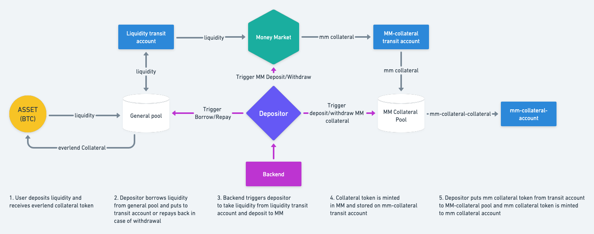

# Everlend

Everlend is a lending aggregator and optimizer. Get the best rates on your liquidity loans, always.

### Flow

### Programs

| Name                                                       | Description                                  |
| ---------------------------------------------------------- | -------------------------------------------- |
| [`depositor`](programs/depositor)                          | Program responsible for rebalance - moving liquidity between General Pool and money markets.                        |
| [`liquidity oracle`](programs/liquidity_oracle)            | Oracle that stores token distribution data and is used by depositor for rebalance |
| [`registry`](programs/registry)                            | Program that stores registry config - a data like program ids and some protocol-wise configs|
| [`universal liquidity pool`](programs/ulp)                 | A basic solana pool to deposit spl token and get minted a collateral token instead|
| [`general pool`](programs/general_pool)                    | An extended ulp, used to deposit and withdraw liquidity by protocol users|
| [`income pools`](programs/income_pools)                    | A pool to store income obtained from MM by the protocol |

### Running tests
    RUST_LOG=solana=debug cargo test-bpf --test ...

### Run individual test
    cargo test-bpf ./general_pool -- test tests general_pool::deposit::success --exact
##### Create required accounts
    RUST_LOG=solana=debug cargo run create --mints SOL

##### Run tests
    RUST_LOG=solana=debug cargo run test full
