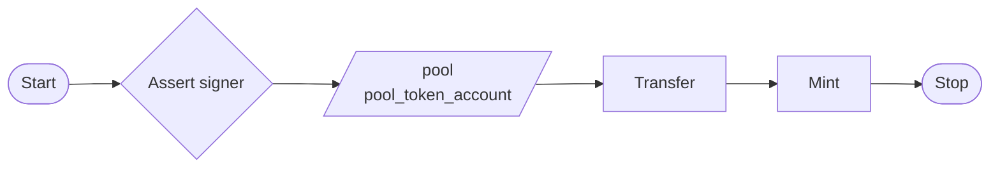

# General pool
Basic general pool instructions
- Deposit
- Withdraw request
- Withdraw

## Deposit
Exchanging a liquidity token for a collateral token.

```mermaid
flowchart LR
  A([Start]) --> CAS{Assert signer}
  CAS --> DP[/pool<br>pool_token_account/]
  DP --> AT[Transfer]
  AT --> AM[Mint]
  AM --> B([Stop])
```

```mermaid
flowchart LR
  subgraph Funds flow
    direction LR
    U(User) --> GP([General Pool])
  end
```
