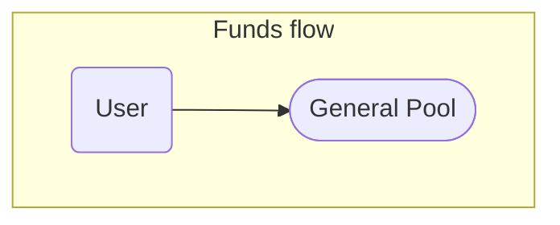

# General pool

### InitPoolMarket
Initializes the Everlend market by the *PoolMarket* account. *PoolMarket* is a storage for single key - *Manager*.
'Manager' is a key which should be a tx signer when create new pools, and creating/update borrow authorities.

### CreatePool
Initializes necessary accounts for creating a new pool, stores relevant keys, such as token_mint, token_account, pool_mint.

### CreatePoolBorrowAuthority
Initializes a *PoolBorrowAuthority* account, which is used by depositor contract to get liquidity from pool for depositing to money markets

### UpdatePoolBorrowAuthority
Updates share_allowed for *PoolBorrowAuthority* account

### DeletePoolBorrowAuthority
Removes *PoolBorrowAuthority* account

### Deposit
Transfers spl tokens from user to pool (*TokenAccount*) and mints collateral token to user.

### WithdrawRequest
Move collateral tokens to transit account and create withdraw request

### Withdraw
Burn collateral tokens and withdraw funds from the pool

### Borrow
User by Depositor to transfer spl tokens from GeneralPool to *LiquidityTransitAccount* using *PoolBorrowAuthority*

### Repay
Return spl tokens back to GeneralPool from *LiquidityTransitAccount*