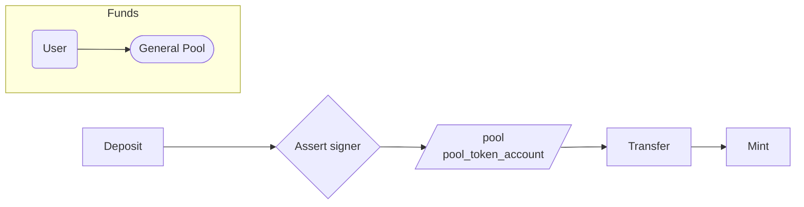

```mermaid
flowchart LR
  A[Deposit] --> CAS{Assert signer}
  CAS --> DP[/pool<br>pool_token_account/]
  DP --> AT[Transfer]
  AT --> AM[Mint]
  subgraph Funds
    direction LR
    U(User) --> GP([General Pool])
  end
```
